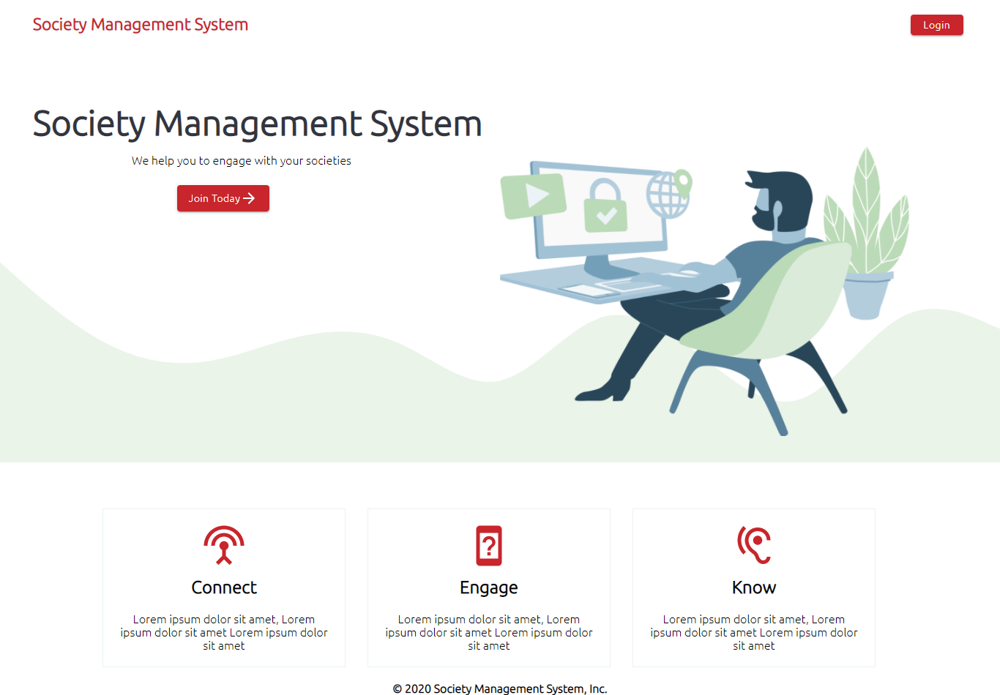
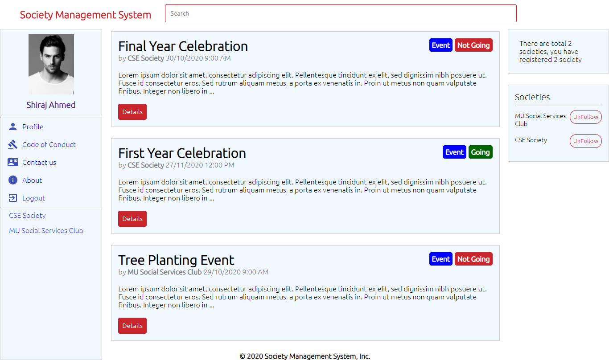
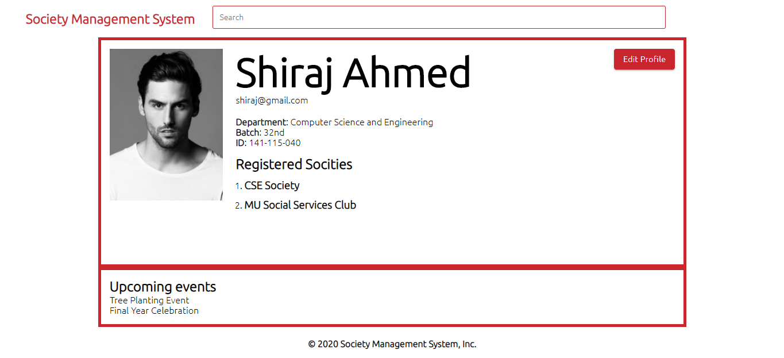
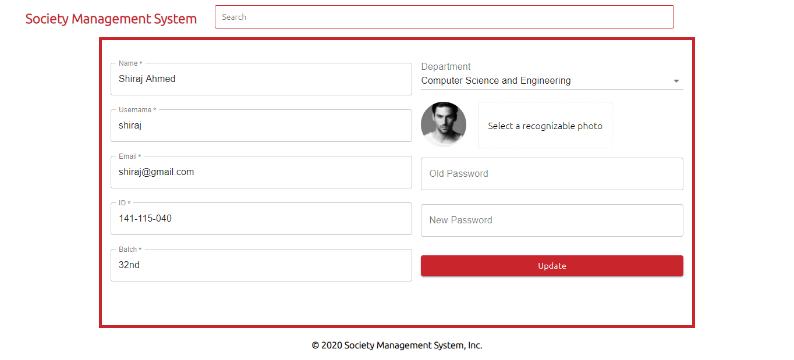
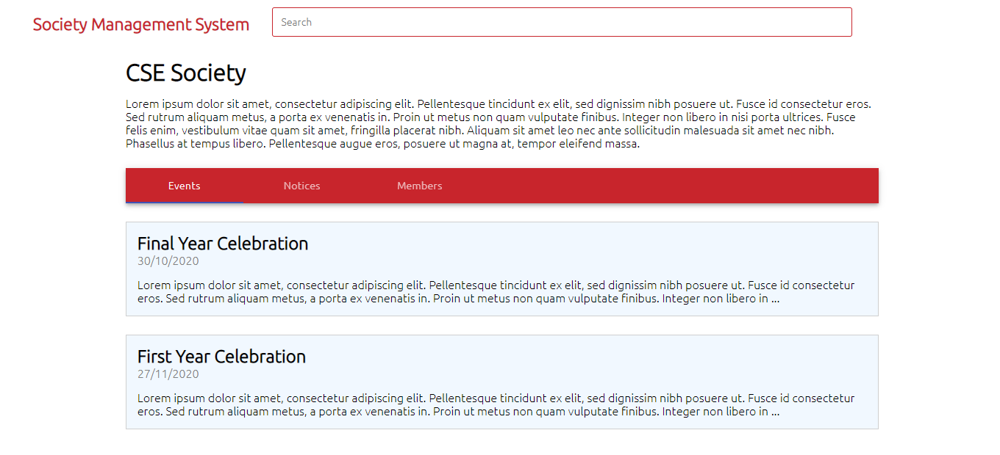
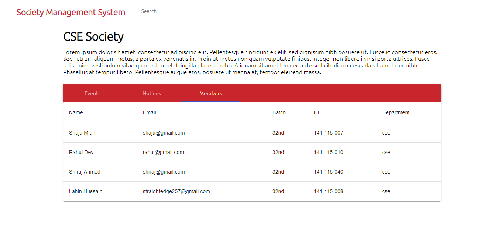

# Society Management System

An application that can gather all the informations for a perticular society and show it to authenticated users. Users can see every informations.

## Stack Used

Server Side

* Node.js
* Express
* Bcrypt.js, JSONWebToken(authentication)
* Express Fileupload(uploading image)
* NodeMailer(sending email)

Database

* MongoDB/Mongoose
* Redis

Client Side

* React
* Context(for state management)
* Material UI(ui component)
* React Testing Library(testing components, DOM elements, Snapshot)
* React.memo(for memoization a pure component)

Others

* Eslint
* Prettier

</img> 
</img> 
</img> 
</img> 
</img> 
</img> 